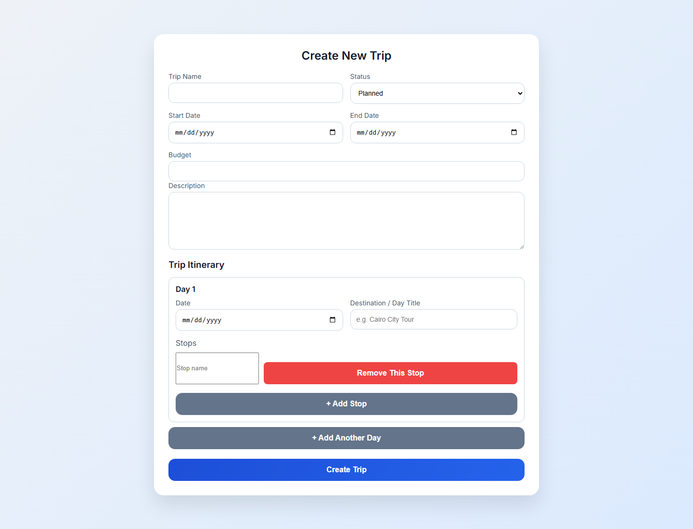
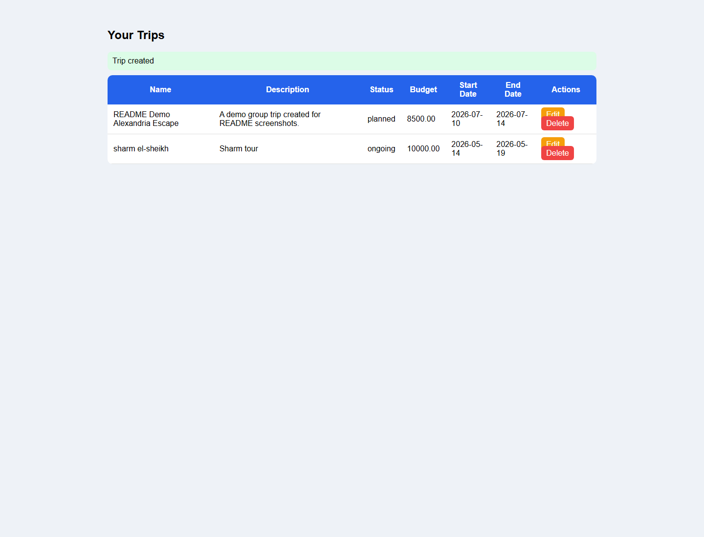
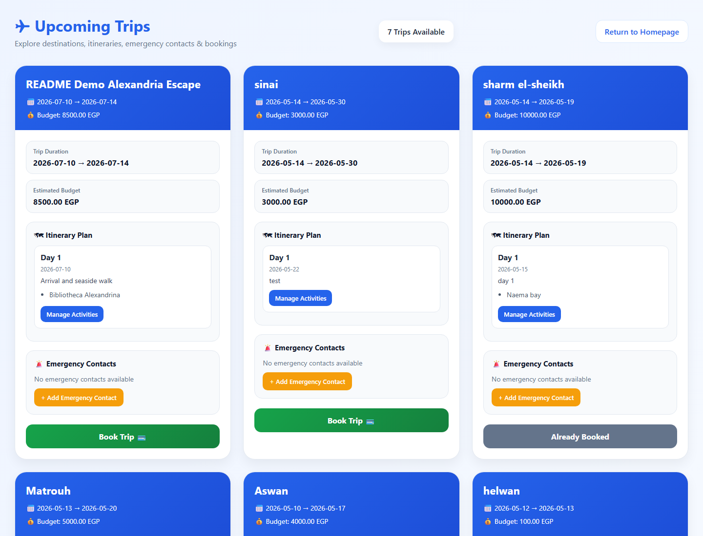
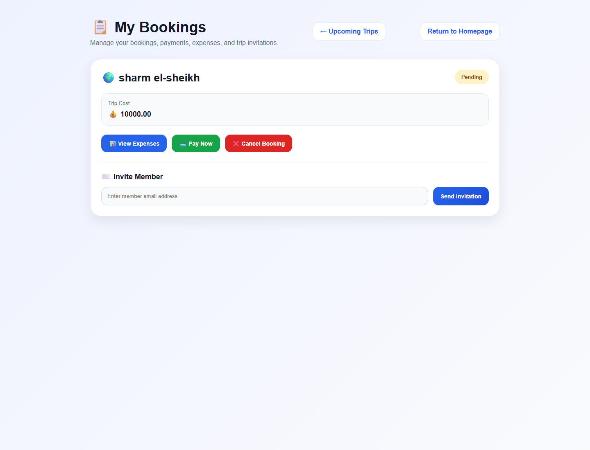
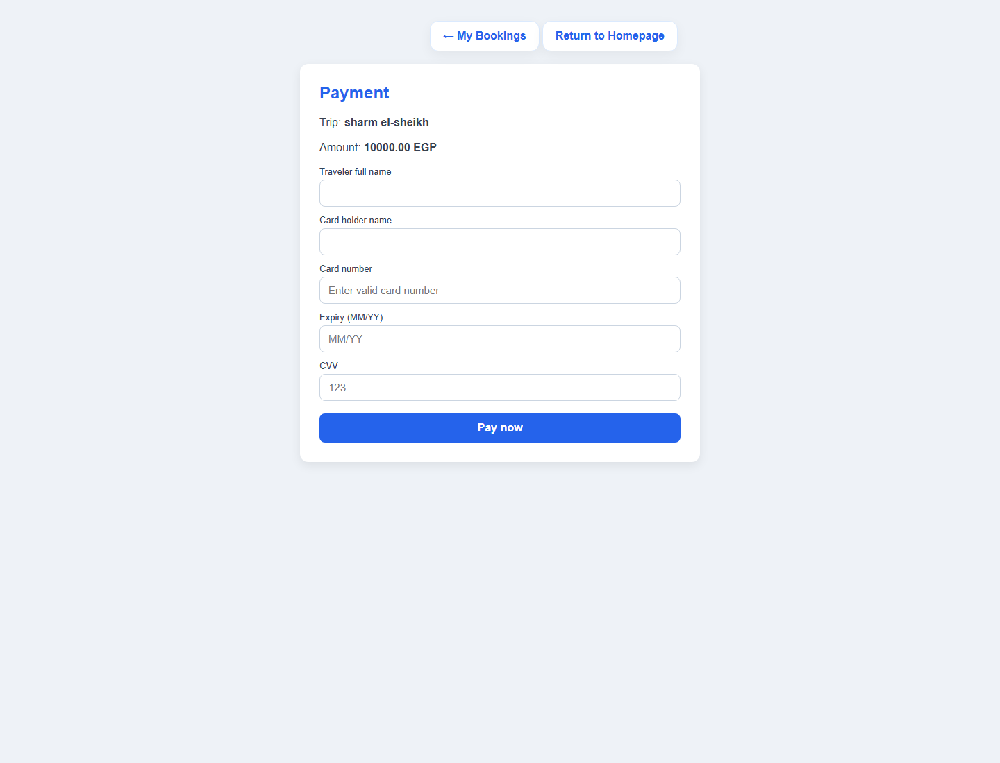
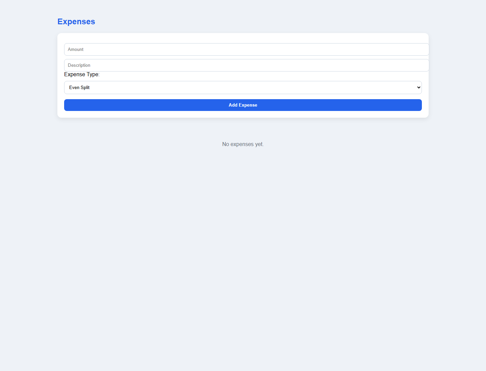
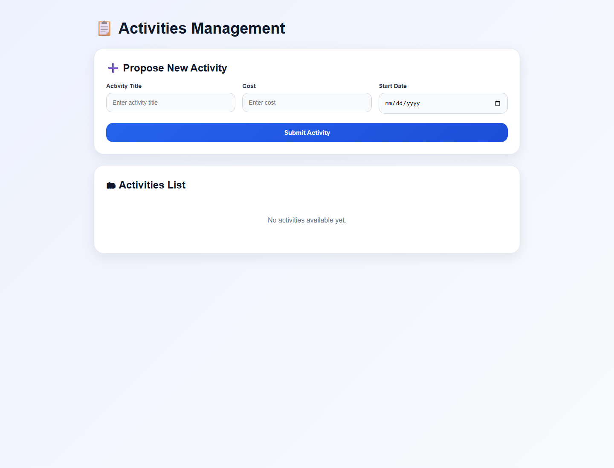
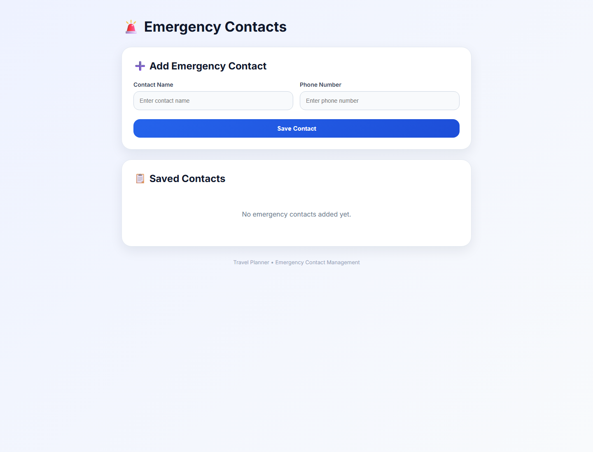
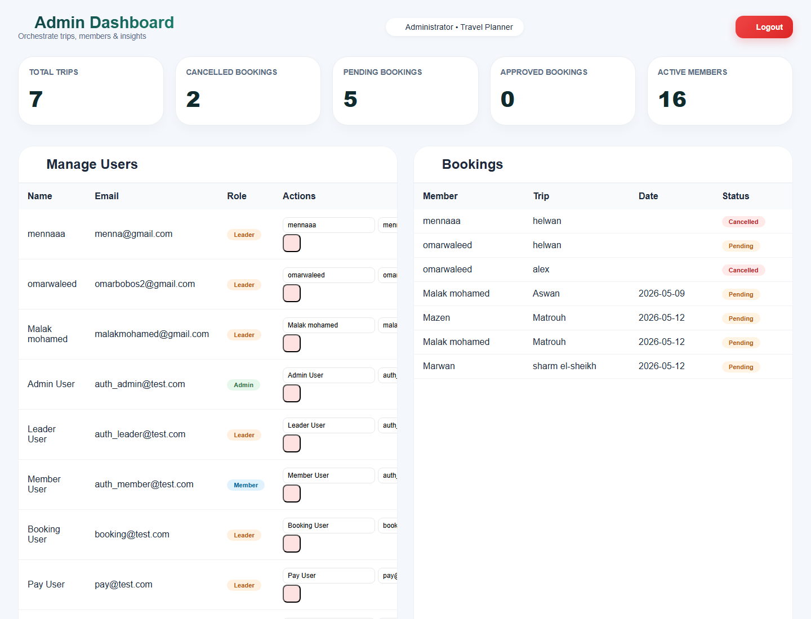

<div align="center">

# WanderPlan Travel Planner

### Collaborative travel planning, booking, payments, expenses, documents, and admin management in one PHP/MySQL web app.


[Features](#features) | [Screenshots](#screenshots) | [Run Locally](#run-locally) | [Testing](#testing) | [Structure](#project-structure)

</div>

---

## Overview

WanderPlan is a full-stack travel planning system built with PHP, MySQL, and a classic MVC-style folder structure. It supports group trip creation, itinerary planning, booking, payments, expenses, travel document uploads, emergency contacts, notifications, and admin reporting.

The app is designed around two main experiences:

- **Travelers and trip leaders** can create trips, manage itineraries, book trips, pay, invite members, track expenses, and organize trip safety details.
- **Admins** can monitor users, bookings, trip counts, active members, and booking status reports from a dedicated dashboard.

---

## Features

| Area | Capabilities |
| --- | --- |
| Authentication | Register, sign in, reset password, role-based redirects |
| Trip Planning | Create trips, edit trips, manage status, budget, dates, and descriptions |
| Itinerary | Add day-by-day plans, destinations, stops, and activity proposals |
| Booking | Browse upcoming trips, book trips, cancel bookings, view booking history |
| Payment | Payment form with booking amount and traveler/card details |
| Expenses | Add expenses, classify split type, view trip expense cards |
| Collaboration | Invite members to trips and manage group participation |
| Safety | Store emergency contacts per trip |
| Documents | Upload passport or national ID documents |
| Admin | Manage users, inspect bookings, and view live summary metrics |
| Quality | PHPUnit test suite with controller and model coverage |

---

## Tech Stack

| Layer | Technology |
| --- | --- |
| Backend | PHP |
| Database | MySQL / MariaDB |
| Local Runtime | XAMPP |
| Testing | PHPUnit |
| Frontend | PHP views, HTML, CSS, JavaScript |
| Architecture | Controllers, Models, Views, SQL scripts, tests |

---

## Screenshots

### Main Experience

| Homepage | Logged-In Homepage |
| --- | --- |
|  |  |

### Trip Creation Flow

| Create Trip | Trip Added |
| --- | --- |
|  |  |

### Traveler Workflow

| Upcoming Trips | My Bookings |
| --- | --- |
|  |  |

| Payment | Expenses |
| --- | --- |
|  |  |

| Activities | Emergency Contacts |
| --- | --- |
|  |  |

| Upload Document | Admin Dashboard |
| --- | --- |
|  |  |

### Authentication

| Sign In | Register |
| --- | --- |
|  |  |

---

## Requirements

- PHP, such as the PHP executable included with XAMPP
- MySQL or MariaDB
- XAMPP Control Panel for local Apache/MySQL management
- Composer, optional for dependency installation

The project is currently configured for this local database:

```text
host: localhost
database: travel_planner1
user: root
password:
```

---

## Run Locally

1. Start **Apache** and **MySQL** from XAMPP.
2. Create or import the `travel_planner1` database in MySQL.
3. Open a terminal in the project root.
4. Start the PHP development server:

```powershell
C:\xampp\php\php.exe -S 127.0.0.1:8000 -t .
```

5. Open the app:

```text
http://127.0.0.1:8000/Views/Auth/signin.php
```

Useful local pages:

| Page | URL |
| --- | --- |
| Sign In | `http://127.0.0.1:8000/Views/Auth/signin.php` |
| Register | `http://127.0.0.1:8000/Views/Auth/register.php` |
| Homepage | `http://127.0.0.1:8000/Views/User/homepage.php` |
| Upcoming Trips | `http://127.0.0.1:8000/Views/User/viewTrips.php` |
| My Bookings | `http://127.0.0.1:8000/Views/User/viewBookings.php` |
| Admin Dashboard | `http://127.0.0.1:8000/Views/Admin/adminDashboard.php` |

Database-backed pages require MySQL to be running with the expected schema and data.

---

## Testing

Run the included PHPUnit PHAR from the project root:

```powershell
C:\xampp\php\php.exe phpunit-9.phar --configuration phpunit.xml
```

Latest local result with XAMPP/MySQL running:

```text
OK (31 tests, 57 assertions)
```

---

## Project Structure

```text
Travel_Planner/
|-- config/                  Database configuration
|-- Controllers/             Request handling and business logic
|-- Models/                  Domain models and database-facing entities
|-- Views/                   PHP pages, UI screens, and static assets
|   |-- Admin/               Admin dashboard
|   |-- Auth/                Sign in, register, reset password, logout
|   |-- User/                Traveler and trip leader workflows
|   `-- Assets/              Images and UI assets
|-- sql/                     Database migration/fix scripts
|-- tests/                   PHPUnit and performance test assets
|-- uploads/                 Uploaded/demo media
|-- screenshots/             README screenshot gallery
|-- composer.json            PHP dependency metadata
|-- phpunit.xml              Root test configuration
`-- README.md                Project documentation
```

---

## Core User Flow

```text
Register / Sign In
        |
        v
Homepage
        |
        +--> Create Trip --> Add Itinerary Days --> Manage Activities
        |
        +--> Browse Upcoming Trips --> Book Trip --> Pay --> View Booking
        |
        +--> Track Expenses --> Invite Members --> Upload Documents
        |
        +--> Add Emergency Contacts
```

Admin flow:

```text
Admin Sign In
        |
        v
Admin Dashboard
        |
        +--> View users
        +--> Edit user roles
        +--> Monitor bookings
        +--> Review trip/member metrics
```

---

## Repository

GitHub: [malakmohamed172/Travel-Planner](https://github.com/malakmohamed172/Travel-Planner)

---

<div align="center">

Built as a complete PHP/MySQL travel planning project with tested booking, activity, payment, expense, document, and admin workflows.

</div>
